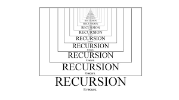

What is recursion?
    A function calling itself.

-> Solving a problem using a smaller instance
of the same problem

The 3 magic steps to apply Recursion to any question -

**Assumption** - In this step, we have to decide what our function will do and believe that it does.
**Main Logic** - This is the recursive step i.e solving the main problem with the help of answers from **sub problems**.
**Base Condition** - In this step, we have to provide the stopping condition. This step is very important otherwise the code will go into an infinite loop.

